# Agent Flow Diagrams

This document contains visual flowcharts for the Phase 3 agent system, illustrating the complete test generation pipeline.

## Table of Contents

1. [Complete Pipeline Overview](#complete-pipeline-overview)
2. [Stage 1: Information Gathering](#stage-1-information-gathering)
3. [Stage 2: Test Generation](#stage-2-test-generation)
4. [User Confirmation Flow](#user-confirmation-flow)
5. [Input Validation Flow](#input-validation-flow)
6. [Error Handling Flow](#error-handling-flow)

---

## Complete Pipeline Overview

This diagram shows the high-level flow of the entire test generation system from user action to final test code.

---

## Stage 1: Information Gathering

This diagram details the logic inside the Stage 1 agent for scenario identification.

---

## Stage 2: Test Generation

This diagram shows the test code generation process in Stage 2.

---

## User Confirmation Flow

This diagram shows the decision tree for when and how to show user confirmation.

---

## Input Validation Flow

This diagram illustrates how user input is validated and guided to improve quality.

---

## Error Handling Flow

This diagram shows how errors are handled throughout the pipeline.

---

## Component Interaction Diagram

This diagram shows how different components interact during the pipeline execution.

```mermaid
sequenceDiagram
    participant User
    participant VSCode
    participant FlowController
    participant InputValidator
    participant Stage1Builder
    participant Stage2Builder
    participant LLMClient
    participant APIProvider

    User->>VSCode: Right-click function → Generate Tests
    VSCode->>VSCode: Extract function context (Phase 2)
    VSCode->>User: Show input dialog
    User->>VSCode: Enter test description

    VSCode->>FlowController: runFullPipeline(context, description)
    FlowController->>InputValidator: validateUserInput(description)
    InputValidator-->>FlowController: ValidationResult

    alt Input invalid
        FlowController-->>VSCode: Return error
        VSCode->>User: Show error + suggestions
    else Input valid
        FlowController->>Stage1Builder: buildPrompt(context, description)
        Stage1Builder-->>FlowController: BuiltPrompt (system + user)

        FlowController->>LLMClient: callStage1(systemPrompt, userPrompt)
        LLMClient->>APIProvider: POST /chat/completions
        APIProvider-->>LLMClient: JSON response
        LLMClient->>LLMClient: Parse & validate Stage1Response
        LLMClient-->>FlowController: Stage1Response

        alt Skip confirmation
            FlowController->>FlowController: Auto-proceed to Stage 2
        else Need confirmation
            FlowController->>VSCode: Return Stage1Response
            VSCode->>User: Show confirmation dialog
            User->>VSCode: Confirm scenarios
            VSCode->>FlowController: Continue with confirmation
        end

        FlowController->>Stage2Builder: buildPrompt(context, scenarios)
        Stage2Builder-->>FlowController: BuiltPrompt

        FlowController->>LLMClient: callStage2(systemPrompt, userPrompt)
        LLMClient->>APIProvider: POST /chat/completions
        APIProvider-->>LLMClient: JSON response
        LLMClient->>LLMClient: Parse & validate Stage2Response
        LLMClient-->>FlowController: Stage2Response

        FlowController-->>VSCode: PipelineExecutionResult
        VSCode->>VSCode: Insert test code into file
        VSCode->>User: Show success message
    end
```

---

## Data Flow Diagram

This diagram shows how data transforms through the pipeline stages.

---

## Notes

- **Solid arrows** indicate mandatory flow
- **Dashed arrows** indicate conditional flow
- **Decision nodes** (diamonds) represent branching logic
- **Process nodes** (rectangles) represent operations
- **Terminal nodes** (rounded rectangles) represent start/end points

These diagrams are generated using Mermaid syntax and can be rendered in GitHub, VSCode, or any Mermaid-compatible viewer.
